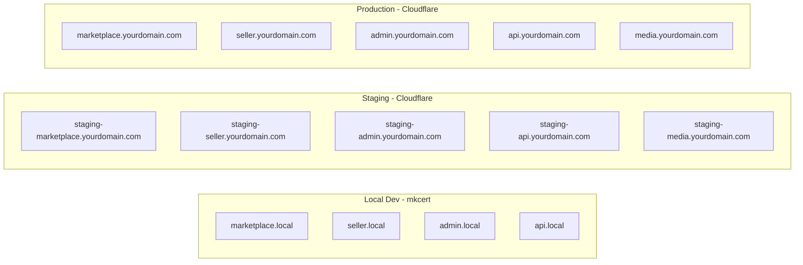

# Domains and SSL Certificate Reference

This document is the single source of truth for every hostname and every SSL certificate used by the platform, across the four app surfaces and the three environments (local, staging, production).

It is derived from:

- `docs/ai-context/INFRA_AND_DEPLOYMENT.md` sections 3 (hostname map), 7 (nginx), 12 (production setup)
- `docs/ai-context/DEV_MODES_AND_COMMANDS.md` section 9 (local-prod mode and mkcert)

Nothing in the repo hard-codes a domain. Every hostname is resolved at runtime from env vars defined in `packages/config/src/env/env.ts` (exposed via `getDomainConfig()`), and the nginx container substitutes them at startup via `envsubst` in `infra/docker/nginx/entrypoint.sh`.

---

## 1. Hostname map

Hosts follow the pattern `<app>.${PUBLIC_DOMAIN_ROOT}` with an optional `${ENV_SUBDOMAIN_PREFIX}` for staging.

| App surface | Local dev | Staging | Production |
|---|---|---|---|
| Customer marketplace | `marketplace.local` | `staging-marketplace.yourdomain.com` | `marketplace.yourdomain.com` |
| Seller portal | `seller.local` | `staging-seller.yourdomain.com` | `seller.yourdomain.com` |
| Platform admin | `admin.local` | `staging-admin.yourdomain.com` | `staging-admin.yourdomain.com` |
| REST API | `api.local` | `staging-api.yourdomain.com` | `api.yourdomain.com` |
| Media / CDN (R2 or S3 custom domain) | `media.local` (unused locally) | `staging-media.yourdomain.com` | `media.yourdomain.com` |

Replace `yourdomain.com` with your registered domain when you cut over to a real environment — but do it through env vars, not by editing nginx configs or source files.



---

## 2. Env vars that drive domain resolution

All set in `env/.env.base`, overridden per mode in `env/.env.<mode>` or `env/.env.prod.example`.

| Variable | Purpose | Dev default |
|---|---|---|
| `PUBLIC_DOMAIN_ROOT` | Bare domain used to synthesize defaults | `local` |
| `ENV_SUBDOMAIN_PREFIX` | Empty for prod, `staging-` for staging | `""` |
| `MARKETPLACE_HOST` | Host for `web-marketplace` | `marketplace.local` |
| `SELLER_HOST` | Host for `web-seller` | `seller.local` |
| `ADMIN_HOST` | Host for `web-admin` | `admin.local` |
| `API_HOST` | Host for `api` | `api.local` |
| `MEDIA_HOST` | Custom domain in front of R2/S3 | `media.local` |
| `SSL_CERT_MODE` | `shared` or `dedicated` | `shared` |

Consumed by:

- `packages/config/src/env/env.ts` — Zod-validated
- `packages/config/src/domains/domains.ts` — `getDomainConfig()`, `buildHost()`, `buildUrl()`
- `infra/docker/nginx/entrypoint.sh` — `envsubst` renders per-app `.conf.template` files
- `env/.env.prod.example` — full production variable list

---

## 3. SSL certificate strategies

The scaffold supports both strategies without code edits. Flip `SSL_CERT_MODE` at the env level and restart nginx.

### Strategy A — shared wildcard (default)

One cert covers every app subdomain.

- Local dev: `pnpm infra:certs` — mkcert issues a single cert for all `.local` hosts, written to `infra/certs/wildcard.{crt,key}`.
- Production: one Cloudflare Origin Certificate issued for `*.yourdomain.com` + `yourdomain.com`.

Pros: simplest rotation (one cert), fewer ops steps. Cons: one compromised key affects every surface.

### Strategy B — dedicated per subdomain

One cert per host.

- Local dev: `bash infra/scripts/certs/generate.sh --mode=dedicated`.
- Production: separate Cloudflare Origin Certificates per host (Cloudflare allows multiple).

Pros: stricter isolation, narrower blast radius. Cons: more certs to rotate, more GitHub secrets to manage.

Hybrid: you can use shared for the three public frontends and dedicated for `api` only. Ops just places the right files in `infra/certs/` — nothing else changes.

---

## 4. Local development (mkcert)

1. `brew install mkcert` (macOS). For Linux/Windows see [FiloSottile/mkcert](https://github.com/FiloSottile/mkcert).
2. Add to `/etc/hosts` (Windows: `C:\Windows\System32\drivers\etc\hosts`):
   ```
   127.0.0.1  marketplace.local
   127.0.0.1  seller.local
   127.0.0.1  admin.local
   127.0.0.1  api.local
   127.0.0.1  media.local
   ```
3. `pnpm infra:certs` — default (shared) mode.
4. `pnpm dev:local-prod:up` — starts the full Dockerized stack with HTTPS on `*.local`.
5. Open `https://marketplace.local`.

Switch to dedicated mode:

```bash
rm -f infra/certs/*.crt infra/certs/*.key
bash infra/scripts/certs/generate.sh --mode=dedicated
# In env/.env.local-prod set SSL_CERT_MODE=dedicated
pnpm dev:local-prod:down && pnpm dev:local-prod:up
```

---

## 5. Production / staging (Cloudflare Origin Certificate)

This is the primary path per `INFRA_AND_DEPLOYMENT.md` section 12.

1. Register the domain, point nameservers to Cloudflare.
2. In Cloudflare DNS, add A records (orange-cloud proxied) for each host in the table above. Frontend hosts point to the frontend droplet IP. `api.*` points to the backend droplet IP. `media.*` is a CNAME to the R2/S3 custom domain.
3. SSL/TLS mode: **Full (strict)**.
4. Generate origin certificates:
   - Shared mode: one cert for `*.yourdomain.com` + `yourdomain.com`.
   - Dedicated mode: one cert per hostname.
5. Copy certs to each droplet:
   ```bash
   scp wildcard.crt deploy@$FRONTEND_DROPLET_IP:/opt/app/certs/
   scp wildcard.key deploy@$FRONTEND_DROPLET_IP:/opt/app/certs/
   ssh deploy@$FRONTEND_DROPLET_IP 'chmod 600 /opt/app/certs/*.key'
   ```
6. The backend droplet needs only `api.{crt,key}` (or the wildcard) — nothing else is public.
7. Set `SSL_CERT_MODE=shared` or `dedicated` in `/opt/app/.env` on each droplet.
8. `docker compose -f /opt/app/docker-compose.frontend.yml up -d` — nginx picks up the certs on entrypoint.

### Let's Encrypt fallback

If you ever need free public certs without Cloudflare proxy, install `certbot` on the droplet and set up nginx with HTTP-01 challenges. Not wired up at scaffold time. Document the per-hostname renew cron when you activate it.

---

## 6. Rotation / rollover checklist

1. Obtain new cert material (from Cloudflare dashboard or your automated issuer).
2. SCP the new files to `/opt/app/certs/` on each droplet. Do not overwrite until step 3.
3. `chmod 600 /opt/app/certs/*.key`.
4. Keep the old files side by side with a `.old` suffix for at least 24h, in case you need to roll back.
5. Rename new files into place (`mv new-wildcard.crt wildcard.crt`).
6. `docker compose exec nginx nginx -t` to validate config.
7. `docker compose exec nginx nginx -s reload`.
8. Run the smoke check workflow (or `curl -I https://<host>`) — verify status, new expiry, correct SAN list.
9. After 24h clean success, remove `.old` files.

---

## 7. Files that reference a hostname

Any rename (e.g. from `yourdomain.com` to your real domain) should touch only these files. Nothing deeper in the app code encodes the domain.

- `env/.env.base`, `.env.local-prod`, `.env.prod.example` — source of truth
- `packages/config/src/env/env.ts` — Zod schema
- `packages/config/src/domains/domains.ts` — runtime helper
- `infra/nginx/conf/*.conf.template` — `server_name ${*_HOST};`
- `infra/docker/nginx/entrypoint.sh` — envsubst pipeline
- `infra/scripts/certs/generate.sh` — hosts array for local mkcert
- `.github/workflows/deploy-staging.yml`, `deploy-production.yml` — smoke check URLs (currently hard-coded to `yourdomain.com` placeholder; update to your real domain at rollout)
- `docs/DOMAINS_AND_SSL.md` (this file)

A single `rg yourdomain.com` should cover the rename surface end-to-end.
